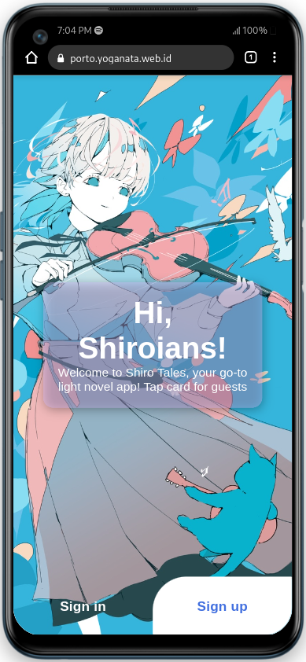
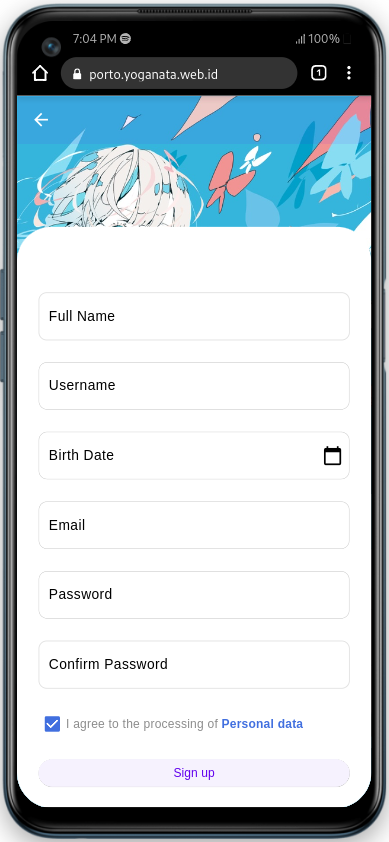
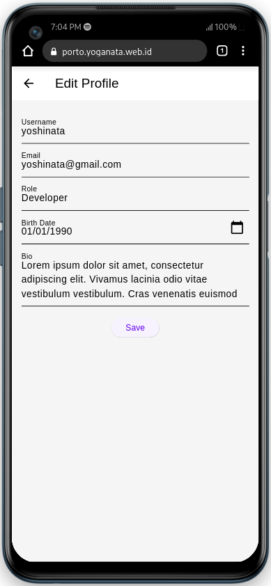

<p align="center"></p>

<p align="center">


</p>

## Tentang Shiro Tales

Shiro Tales Flutter adalah aplikasi web light novel yang dibangun menggunakan Flutter. Aplikasi ini bertujuan untuk memberikan pengalaman membaca yang mulus bagi pengguna yang tertarik dengan light novel.

### Instalasi

#### Clone Repository
```bash
git clone https://github.com/Yoganataa/shiro-tales-flutter
```

#### Kredit Halaman Beranda
Desain halaman beranda terinspirasi dari [Book App](https://github.com/gulsenkeskin/book-app).

#### Kredit Halaman Welcome, Signin, Signup
Halaman-halaman ini diadaptasi dari [Login Signup Forms](https://github.com/EverydayFlutter/login-signup-forms).

#### Kredit Bottom Navigation Bar
Bottom navigation bar terinspirasi dari [Animation Nav Bar](https://github.com/sudeshnb/animation_nav_bar).

#### Kredit Desain Profil Pengguna
Desain UI profil diambil referensi dari [Profile App UI](https://github.com/jameelsocorro/profile_app_ui).

### Instalasi

#### Install Dependensi
```bash
flutter pub get
```

#### Menjalankan Aplikasi
```bash
flutter run
```

## Dokumentasi
 
 




